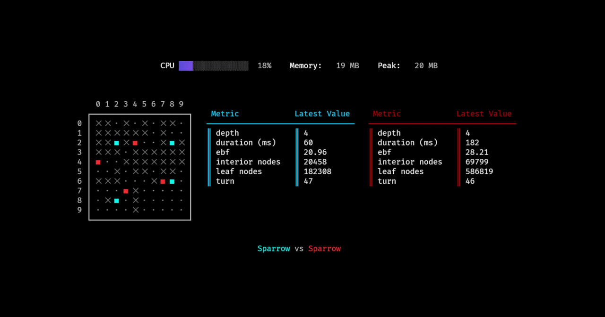

# EDI

[](https://pkg.go.dev/github.com/Chad-Glazier/edi)

The EDI Project is an effort to analyze the programs that play the [Game of Amazons](https://en.wikipedia.org/wiki/Game_of_the_Amazons). While Amazons hasn't gained much popularity among human players, in the 2000's it began to attract [quite a bit of attention](https://scholar.google.com/scholar?hl=en&as_sdt=0%2C5&q=the+game+of+amazons&btnG=) as a research subject in the field of AI. To this day, researchers will occasionally take a swing at trying to improve Amazons programs or invent entirely new approaches using modern hardware. However, most of the existing research on the game focuses on justifying and improving the authors' individual programs. In contrast, EDI is an effort to implement a variety of programs for the sake of directly comparing them in terms of both raw performance (i.e., who wins more often) as well as more specific analytics that quantify the effectiveness of their optimizations.

The EDI project has two main parts: the [core library](#using-the-library) implements some of the common elements for Amazons programs. This includes functions to help construct and search the game tree, as well as heuristics to evaluate board states. The current implementations are reasonably well-optimized, though there is known [room for improvement](#room-for-improvement). The second half is a [CLI tool](#using-the-cli) that lets you analyze programs and watch them play against each other.

## Using the CLI



At the time of writing the only way to install the CLI is with [Go](https://go.dev/doc/install). If you have Go installed, this is as straightforward as running the following command:

```sh
go install github.com/Chad-Glazier/edi@latest
```

From there, you should be able to run the `edi` command. The CLI's help messages should be plenty enough to guide you through the usage. 

Notably, there are a few sub-commands that you can use to run games between programs or to analyze the performance of an individual program. Metrics collected throughout a game can optionally be written to CSV files so that users can perform whatever analysis or visualizations they prefer.

## Using the Library

The main library behind EDI gives you the tools to do the following:
- Construct and traverse the game tree with the [state](https://pkg.go.dev/github.com/Chad-Glazier/edi/state) package.
- Use low-level bitboards yourself with the [bb](https://pkg.go.dev/github.com/Chad-Glazier/edi/bb) package.
- Search the game tree with predefined methods in the [search](https://pkg.go.dev/github.com/Chad-Glazier/edi/search) package(s).
- Use predefined evaluation functions and common terms with the [eval](https://pkg.go.dev/github.com/Chad-Glazier/edi/eval) package.
- Try out existing Amazons programs defined in the [vi](https://pkg.go.dev/github.com/Chad-Glazier/edi/vi) package. The notable programs are listed below.
  - *Arrow* is a program created by Martin Muller and Theodore Tegos and documented in their 2002 paper ["Experiments in Computer Amazons"](https://www.cambridge.org/core/books/abs/more-games-of-no-chance/experiments-in-computer-amazons/F12D696AF38F435BC2C47E41DAA621E4).
  - *EDI* is a program created by myself to participate in an undergraduate computer amazons tournament held at UBC in early 2026. My original report for the Java implementation can be found [here](https://raw.githubusercontent.com/Chad-Glazier/edi/main/docs/EDI_Report.pdf).

The following minimal example demonstrates some of the library's functionality by making two programs play against each other.

```go
package main

import (
	"fmt"
	"time"

	"github.com/Chad-Glazier/edi/vi"
	"github.com/Chad-Glazier/edi/eval"
	"github.com/Chad-Glazier/edi/state"
)

func main() {

	// First, we select the VI (i.e., game-playing programs) we want to pit
	// against each other.
	white := vi.NewSparrow()
	black := vi.NewArrow()

	// Next we set up the initial board state and decide a per-turn time limit.
	board := state.Initial()
	turnTimer := 5 * time.Second

	// The Game of Amazons is over when the active player has no available 
	// moves.
	for !board.IsTerminal() {

		var move state.Move

		// The "consult" method of a VI tells it to recommend a move within
		// the allotted time limit. The "player" field of a board state tracks
		// which player should move next.
		if board.Player == state.White {
			move, _ = white.Consult(board, turnTimer)
		} else {
			move, _ = black.Consult(board, turnTimer)
		}

		// The "apply" method will err if the given move is illegal.
		newBoard, err := state.Apply(board, move)
		if err != nil {
			panic(err.Error())
		}

		// We quickly evaluate the board state to assess who is winning. By
		// convention, heuristic evaluation functions return positive values to
		// represent favorability for White and negative values for Black.
		evaluation := eval.QMinDist(newBoard)
		switch {
		case evaluation > 0:
			fmt.Println("looks like White is winning...")
		case evaluation < 0:
			fmt.Println("looks like Black has the upper hand...")
		default:
			fmt.Println("the game is remarkably close...")
		}

		// Finally, we update the board state.
		board = newBoard
	}

	// By the time the loop terminates, we know that the active player has 
	// failed to make a move and must have lost the game. 
	if board.Player == state.White {
		fmt.Println("Black wins!")
	} else {
		fmt.Println("White wins!")
	}
}
```

## Room for Improvement

As far as the library is concerned...
- A SIMD reimplementation of bitboards and specific operations may significantly improve performance. This should be investigated.
- More evaluation functions should be implemented. E.g., the various terms in [Amazong](https://www.sciencedirect.com/science/article/pii/S0304397505005979).
- At least some form of Monte Carlo search should be implemented.


For the CLI...
- It would be cool if a game server/client was implemented so that Amazons games can be hosted and played between programs on different machines and implemented in any language.
